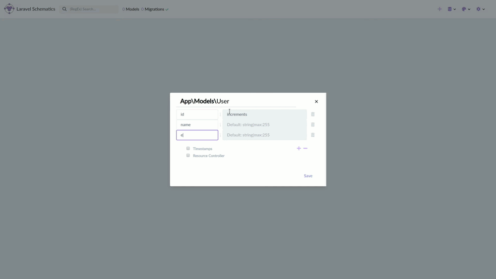
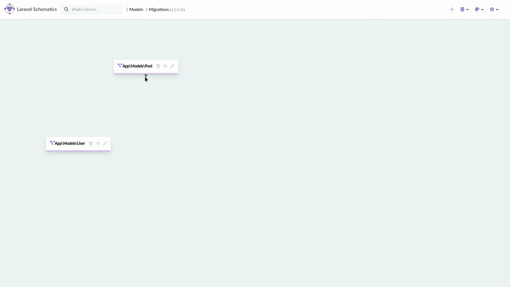
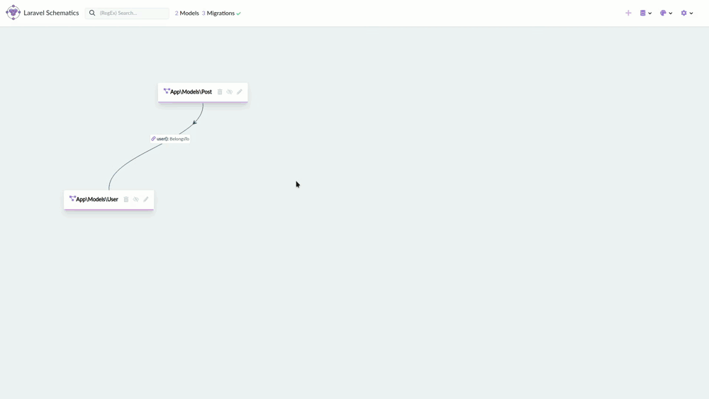
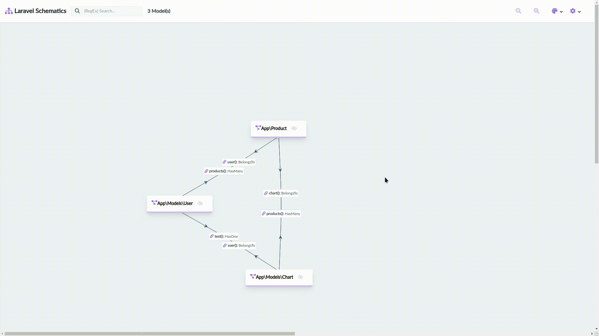

# Laravel Schematics

[](https://packagist.org/packages/mtolhuys/laravel-schematics)
[](https://travis-ci.org/mtolhuys/laravel-schematics)
[](https://scrutinizer-ci.com/g/mtolhuys/laravel-schematics)
[](https://packagist.org/packages/mtolhuys/laravel-schematics)

This package will map your Eloquent models, relation methods and migrations.
It will help building them, use drag and drop relations, run and roll back migrations.
You can see a diagram of the results visiting `{your-app}/schematics`

For example: 

### Adding a model
- Creating a User model with the timestamps and resource controller options.



### Adding a relation
- Created a Post model and drag and dropped it's relation to User.



### Removing a relation
- Removing a relation through the interface.



### Changing the diagram
- You can change you're style and export/import them.



PS: This package is still in BETA stage. More features coming soon!
    
## Installation

You can install the package via composer:

```bash
composer require mtolhuys/laravel-schematics
```

## Usage
Run `php artisan schematics:install` which will do everything necessary.

Or...

```php
php artisan vendor:publish --provider="Mtolhuys\LaravelSchematics\LaravelSchematicsServiceProvider"`
```

and visit `{your-app}/schematics

Make sure the routes are cached!

### Changelog

Please see [CHANGELOG](CHANGELOG.md) for more information what has changed recently.

## Contributing

Please see [CONTRIBUTING](CONTRIBUTING.md) for details.

### Security

If you discover any security related issues, please email mtolhuys@protonmail.com instead of using the issue tracker.

## Credits

- [Maarten Tolhuijs](https://github.com/mtolhuys)
- [All Contributors](../../contributors)

## License

The MIT License (MIT). Please see [License File](LICENSE.md) for more information.
