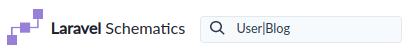
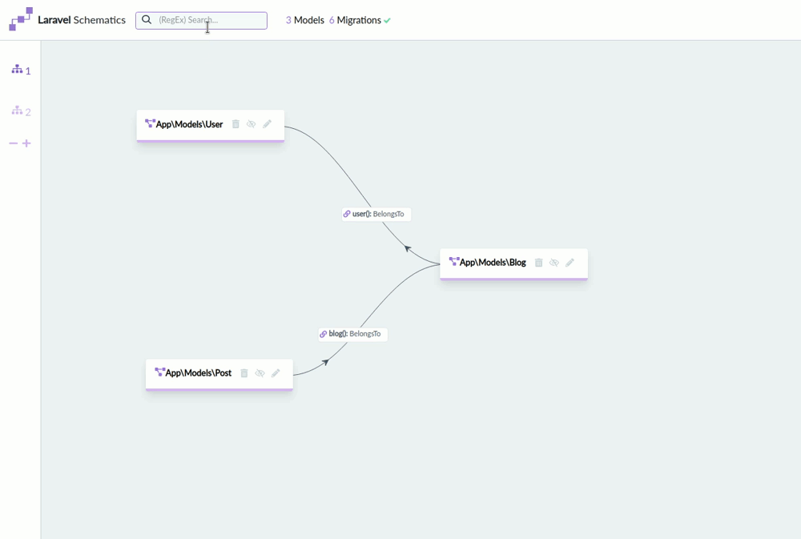
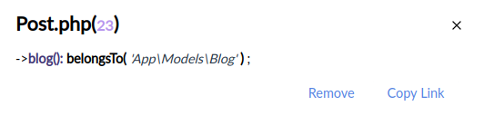
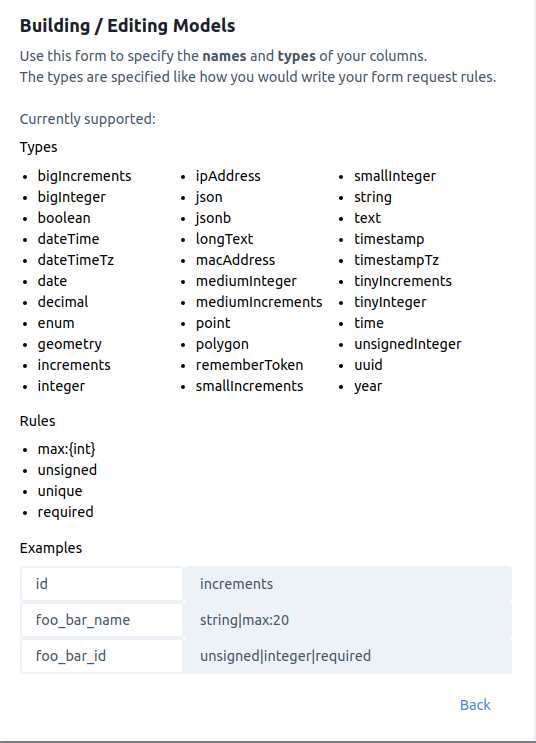
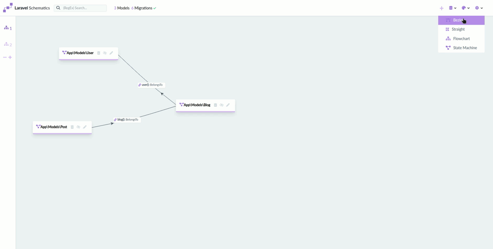
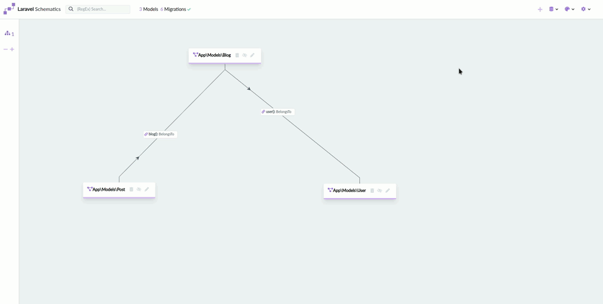

<h1>
    
    Laravel Schematics
</h1>

[](https://packagist.org/packages/mtolhuys/laravel-schematics)
[](https://travis-ci.org/mtolhuys/laravel-schematics)
[](https://scrutinizer-ci.com/g/mtolhuys/laravel-schematics)
[](https://packagist.org/packages/mtolhuys/laravel-schematics)

This package allows you to make multiple **diagrams** of your Eloquent **models** and their **relations**.
It will help building them providing drag and drop relations, forms to **create** and **edit** your models and many options like
adding **resource controllers**, running **migrations** by the click of a button or (configurable) automatically.
It also will give you insights in the migrations you ran and the ones specified in your migrations folder.  


Its aim is to help you (and your team) get more grip on the models from a code perspective, 
the status of your migrations and build / edit them faster.

---
    
## Installation

You can install the package via composer:

```bash
composer require mtolhuys/laravel-schematics
```

Run `php artisan schematics:install` which will do the route caching, create vendor assets in your public folder and
setup the configuration file.

Or...

```php
php artisan vendor:publish --provider="Mtolhuys\LaravelSchematics\LaravelSchematicsServiceProvider"
```

and visit `{your-app}/schematics`

Make sure the routes are cached!

---

## Usage

##### Starting out / Searching
If you already have a lot of models I recommend you use the search bar to narrow down the diagrams into 
specific sections f.e:



These searches are saved across your diagrams.



##### Relations
When you drag and drop the arrow to another model you'll get a form to specify the relation you want to build f.e:


Clicking on them will show something like:



##### Building / Editing Models

To specify the types of your columns I've chosen the form request rule syntax. 
To see what's available you can click the little help icon below the fields in the model form:



The package is flexible enough to differentiate between renaming and changing column types. 
It will create migrations according the need to change or create a table and setup your `$fillables`.
I do **strongly** suggest you check the migrations before running them if the stakes are high.

##### Changing Diagram Style

There are 4 diagram styles. Bezier, Straight, Flowchart and State Machine:



##### Importing / Exporting Diagrams

To save and / or share the diagrams you created you can use the export and import settings feature:



---

### Testing

You can run the tests with:

```bash
composer test
```

Or, optionally, with coverage information:

```bash
composer test-coverage
```

### Changelog

Please see [CHANGELOG](CHANGELOG.md) for more information what has changed recently.

## Contributing

Please see [CONTRIBUTING](CONTRIBUTING.md) for details.

### Security

If you discover any security related issues, please email mtolhuys@protonmail.com instead of using the issue tracker.

## Credits

- [Maarten Tolhuijs](https://github.com/mtolhuys)
- [All Contributors](../../contributors)

## License

The MIT License (MIT). Please see [License File](LICENSE.md) for more information.
