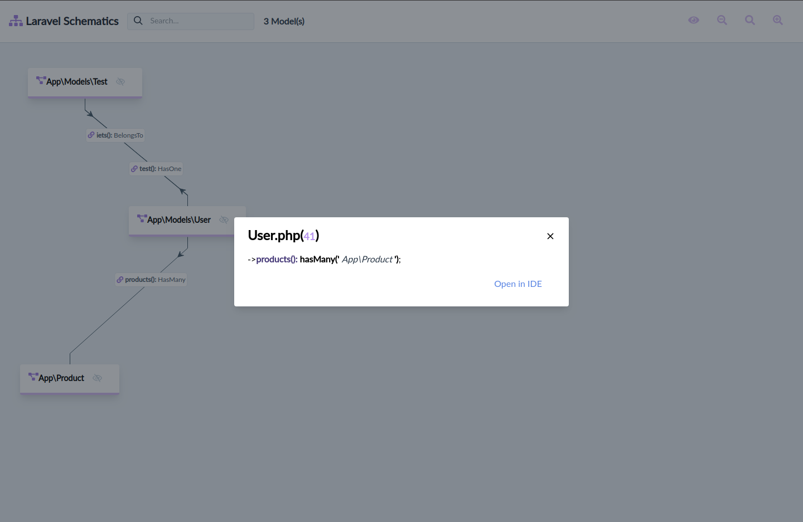

# Laravel Schematics (WIP)

This package will map your Eloquent models and methods calling first level relations.
You can see a flowchart of the results visiting /schematics 


Example result: 


### Testing

``` bash
composer test
```

### Changelog

Please see [CHANGELOG](CHANGELOG.md) for more information what has changed recently.

## Contributing

Please see [CONTRIBUTING](CONTRIBUTING.md) for details.

### Security

If you discover any security related issues, please email mtolhuys@protonmail.com instead of using the issue tracker.

## Credits

- [Maarten Tolhuijs](https://github.com/mtolhuys)
- [All Contributors](../../contributors)

## License

The MIT License (MIT). Please see [License File](LICENSE.md) for more information.
